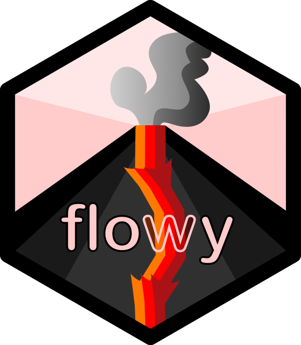
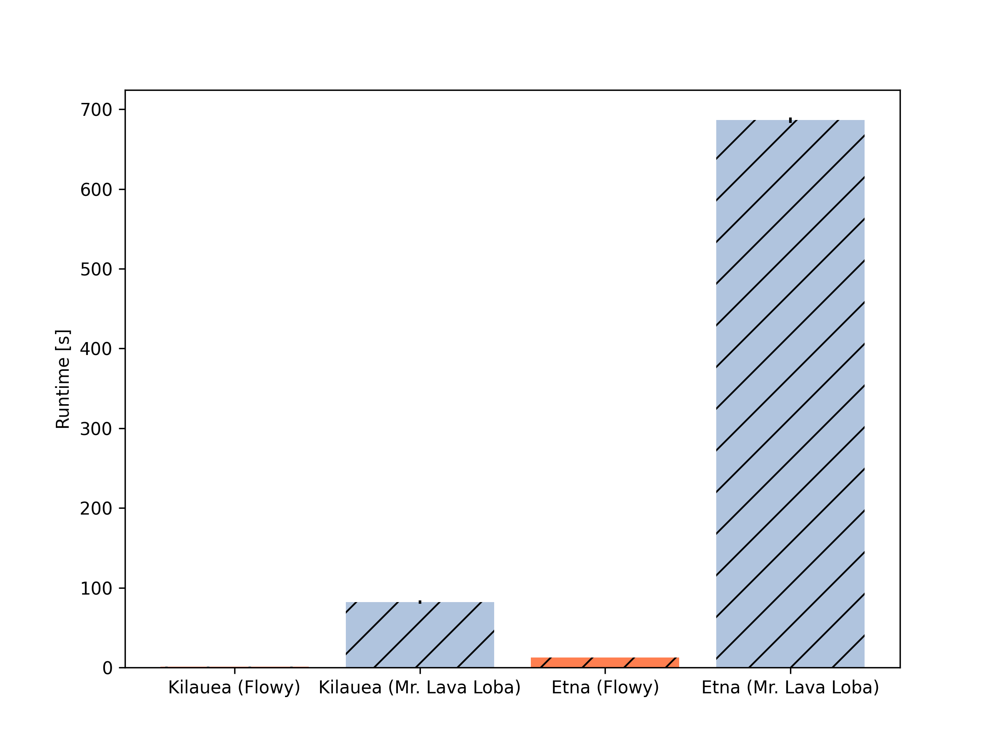
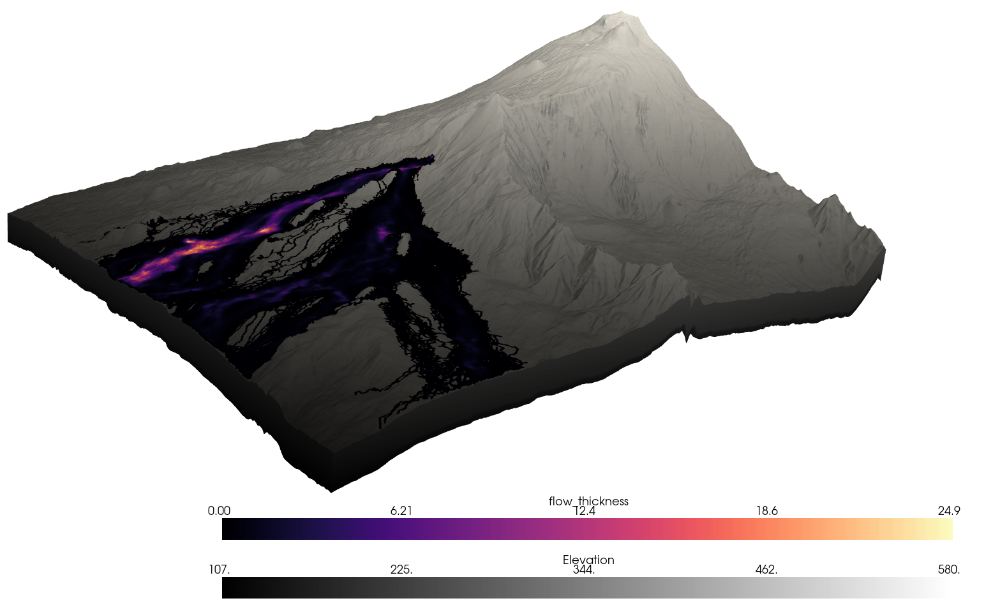
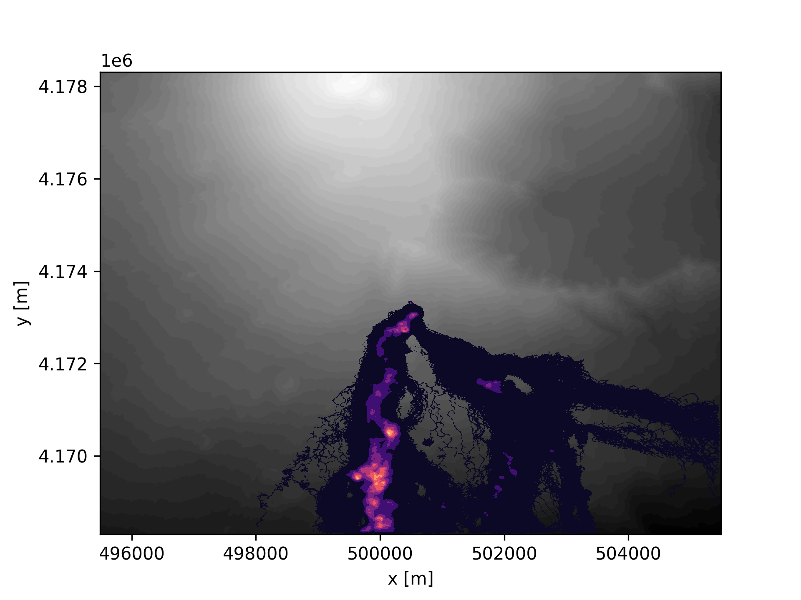
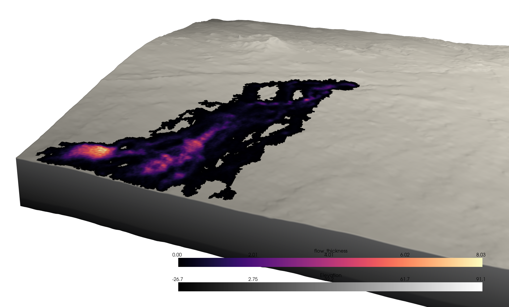

# Flowy - A code to simulate lava emplacement.


## About

Flowy is a probabilistic code to simulate the emplacement of lava. It is a re-implementation of the Mr. Lava Loba method [1,2] in C++20.

## Installation of dependencies with [`micromamba`](https://mamba.readthedocs.io/en/latest/user_guide/micromamba.html)
To install micromamba, execute
```bash
"${SHELL}" <(curl -L micro.mamba.pm/install.sh)
```
For details, refer to the micromamba docs [here](https://mamba.readthedocs.io/en/latest/installation/micromamba-installation.html).


Then, create and activate the environment.

```bash
micromamba create -f environment.yml
micromamba activate flowyenv
```

## Compilation and Installation

We use `meson` to compile and build `flowy`.

```bash
meson setup build
meson compile -C build
```

To install `flowy` to your `conda` environment, run the following:

```bash
meson setup build --prefix $CONDA_PREFIX
meson install -C build
```

## Benchmark
Both codes were run on the examples and the runtime was averaged over 10 runs. Flowy is about __100 times faster__ on the Kilauea example and about __50 times faster__ on the Mt. Etna example.




### Runtime in seconds
|               | Etna                | Kilauea             |
|---            |---                  |  ---                |
| Flowy         |   $13.343 \pm 0.1$ s| $0.779 \pm 0.1$ s  |
| Mr. Lava Loba |  $686.330 \pm 3.3$ s| $81.989 \pm 2.1$ s  |

## Gallery

### Mt Etna 2001 LFS1 flow field



### Kilauea 2014-2015 flow field


## References
[1] Mattia de' Michieli Vitturi, Simone Tarquini, "MrLavaLoba: A new probabilistic model for the simulation of lava flows as a settling process"
Journal of Volcanology and Geothermal Research, 2018.

[2] https://github.com/demichie/MrLavaLoba
